二手物品回收小程序介绍文档(迭代四)

1. ##### 作品概述

   1. 小程序说明介绍

   > 本小程序为用户提供一个买卖二手物品的综合平台。本小程序支持上传自己待售物品、查看所有待售物品、邀请好友等等。

   2. 应用背景

   > 在日常生活中，我们会经常因为冲动而造成一系列不理智消费，有些物品可能使用了几次之后甚至于没有使用就被扔至一边，从而造成了一系列的浪费，然而对这些商品或者自己不需要的商品进行出售，它们本身的价值可以得到充分发挥，而且在一定程度上还可以缓解自己的经济压力。本小程序将会应用在日常生活中，所有人将会是本小程序的主要服务对象。该小程序致力于打造一个二手交易平台。

2. **小程序设计介绍**

   由于微信小程序限制，个人类型的开发者无法使用微信中的支付等功能，因此该小程序没有实现支付功能，仅仅只有一个包含钱包的页面，具体功能并未实现。由于时间不足，还有其余一些只有界面的功能，具体功能并未完善。以下是已经完成的功能，在浏览小程序时可以参照此文档得到一个较为流畅的体验。

   用例图：

   

   - 登录注册功能
   
     用户可以通过选择手机号登录以及账号密码登录进行登录，在登录中会进行判断密码是否正确。
   
     点击注册按钮跳转至注册页面，根据输入框提示一步一步进行完成注册功能，手机号输入框至多输入11位，密码长度限制在6位至18位数组或字母，第二次重复输入密码，点击注册按钮会判断两次密码是否相同，选择用户类型个人用户或者回收商家。
   
     已存在账户：
   
     手机号：十一个1
   
     密码：111111
   
     用户名：lhc
   
     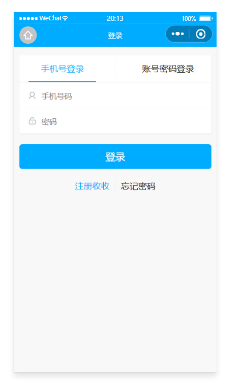
   
     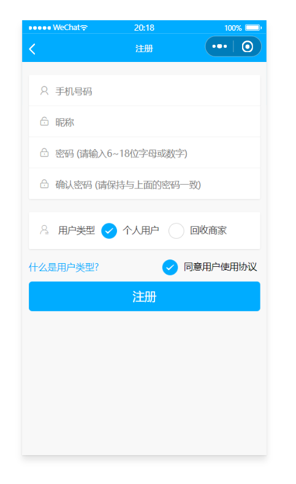
   
   - 查看个人信息
   
     用户第一次点击我的页面是会自动跳出登录页面，如果用户不想要注册而直接浏览该小程序，可以直接返回，此时会以一个默认账户状态浏览小程序的相关信息，不会需要用户强制登录可以以游客身份浏览，但此时用户无法进行增加出售商品信息的操作。
   
     如果用户注册登录后，用户可以查看自己的信息，并体验其余功能。
   
     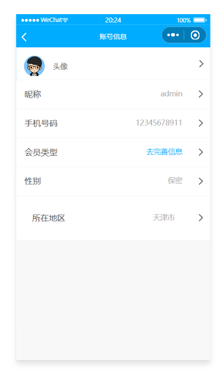
   
   - 分享好友
   
     用户觉得使用感不错，可以点击-我的-微信分享分享给好友
   
     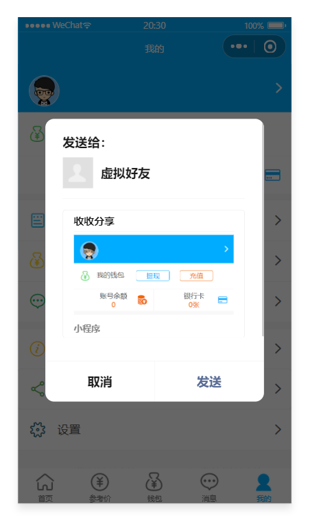
   
   - 进行待售物品信息登记
   
     用户按照提示一步一步填写相关信息，点击提交之后该商品信息会存入数据库。
   
     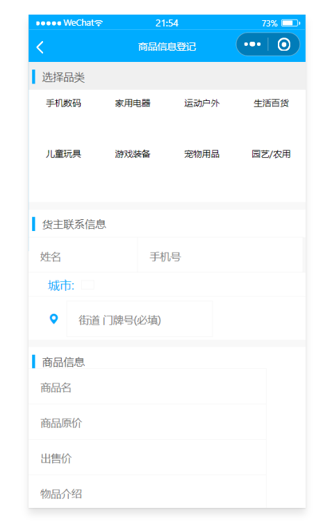
   
   - 实现商品页面的加载
   
     从数据库中查询数据然后展示：
   
     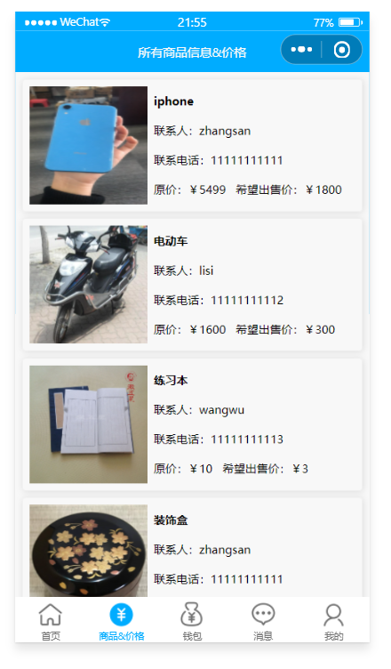
   
   - 实现自己登记页面的加载
   
     自己的登记信息查看：
   
     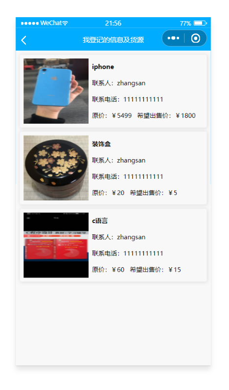
   
   - 商品详情页面设计
   
     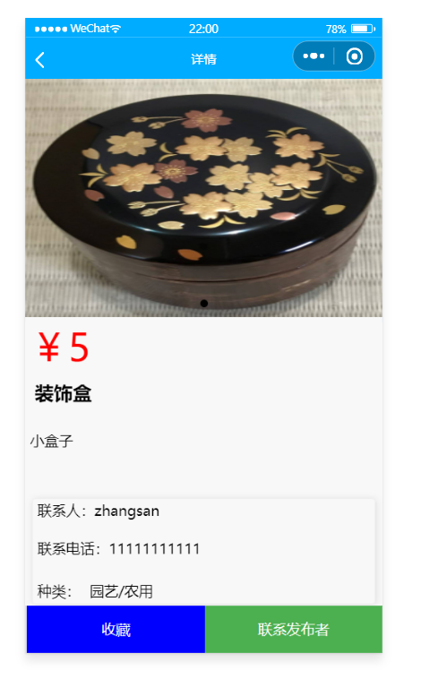
   
   - 添加收藏以及查看收藏
   
     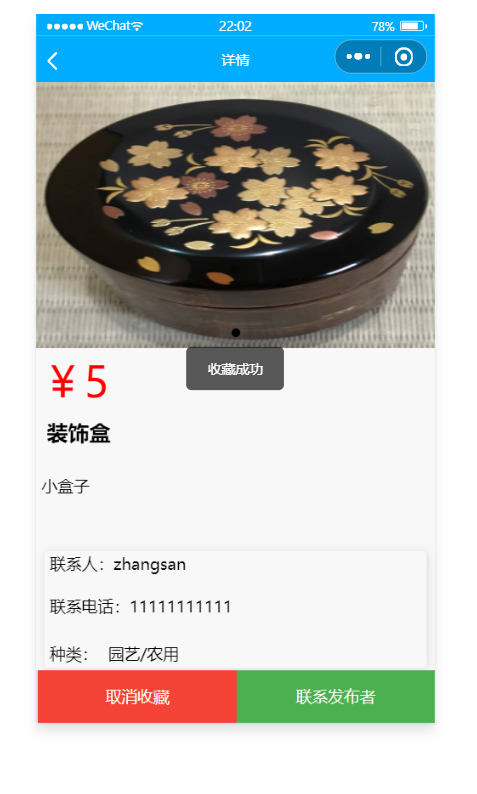
   
     查看我的收藏：
   
     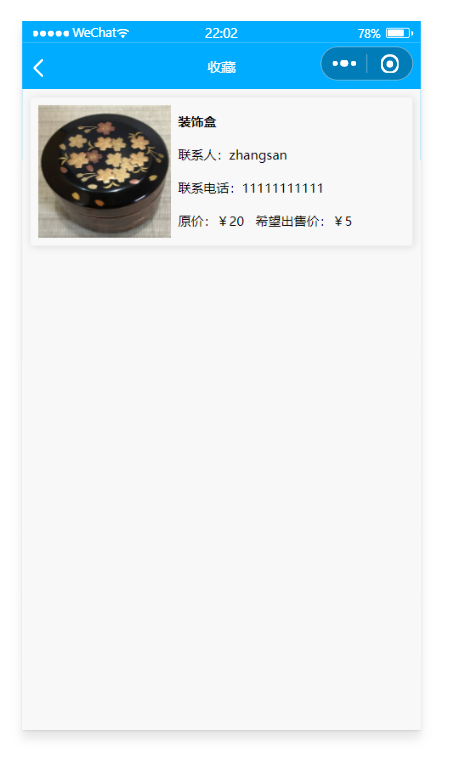
   

3. **代码介绍**

   前端：通过wxml设计页面，wxss渲染页面，组件均使用微信原生组件。

   后端：

   - 使用微信云开发来为微信小程序提供后端的服务。

   - 使用微信云开发存储实现图片的上传与显示

     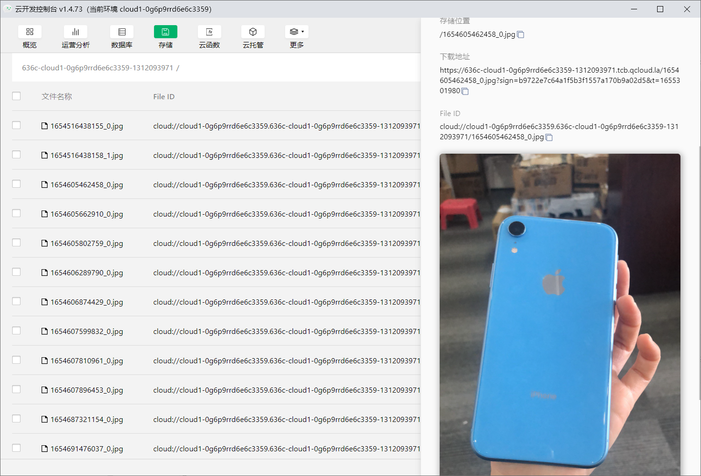

   - 使用云开发中的云数据库来为微信小程序提供数据存储。通过云数据库提供一系列增删改查功能
   
     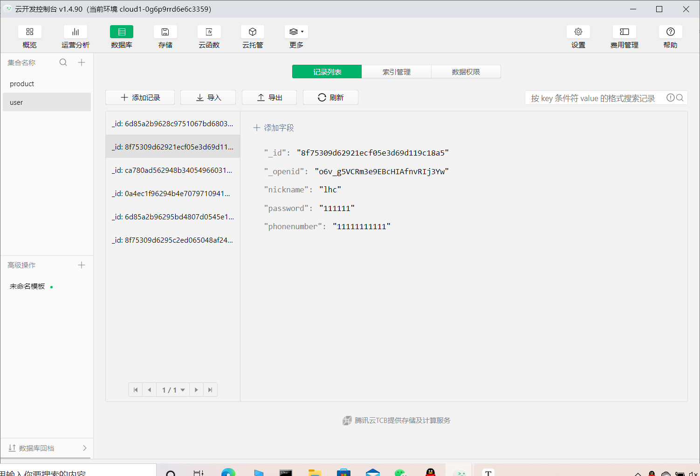
   
   - 部分需要全局使用的数据（如用户登录后的信息）采用本地缓存：
     - [wx.setStorageSync](https://developers.weixin.qq.com/miniprogram/dev/api/storage/wx.setStorageSync.html)
     - [wx.getStorageSync](https://developers.weixin.qq.com/miniprogram/dev/api/storage/wx.getStorageSync.html)

​					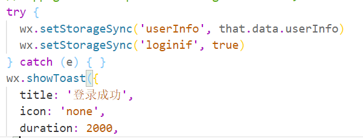

